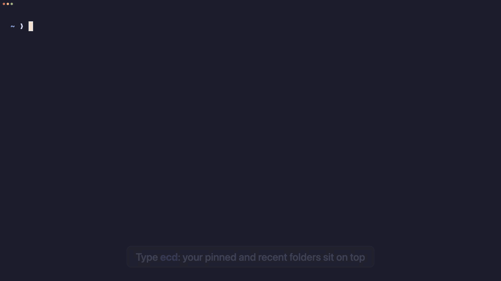

# easy-cd

Stop typing paths. Type `ecd`, pick a folder with the arrow keys or a few letters, press Enter.



[Watch the demo as a video (MP4)](demo/demo.mp4)

## Install

```sh
brew install banozz0/tap/easy-cd
```

Or with Go 1.25+: `go install github.com/banozz0/easy-cd/cmd/ecd@latest`. Prebuilt
macOS and Linux binaries are on the [releases page](https://github.com/banozz0/easy-cd/releases).

Then add one line to your shell's config and open a new shell:

| Shell | Line | File |
|---|---|---|
| zsh | `eval "$(ecd init zsh)"` | `~/.zshrc` |
| bash | `eval "$(ecd init bash)"` | `~/.bashrc` (macOS: `~/.bash_profile`) |
| fish | `ecd init fish \| source` | `~/.config/fish/config.fish` |

The line defines an `ecd` function that changes your shell's folder. Plain `cd` is left alone.

## Keys

| Key | Does |
|---|---|
| ↑ ↓ | move |
| → | open a folder, read a file |
| ← | up one level |
| Enter | cd there; a file opens in its app and your shell lands in its folder |
| letters | search every folder under home (Backspace edits, Esc clears) |
| 1–9 | jump to a pinned or recent folder |
| Ctrl+P | pin or unpin the highlighted folder |
| Shift+← | back to home |
| Tab | flip between the list and Finder-style columns |
| Esc | quit; your shell stays where it was |

In the reader, ↑ ↓ PgUp PgDn scroll and ← or Esc goes back.

## How it picks

- **Pins** are slots 1–3, up to three folders you choose with Ctrl+P.
- **Recents** fill slots 4–9: the folders you landed in with Enter or 1–9, scored by how
  often and how lately, as in zoxide. Folders you only walk through don't count, and neither do home, `/`
  or temp folders.
- **Search** covers every folder under home, four levels deep, plus any folder you've
  visited. An exact name ranks first, then names that start with what you typed, then names
  that contain it. Folders under the one you're in, and folders you've been visiting, get a boost.
  Loose letter-by-letter matches only show when almost nothing else does.

## Where it keeps things

| What | Where |
|---|---|
| Visit log and pins | `$XDG_STATE_HOME/ecd`, or `~/.local/state/ecd` |
| Folder index | `$XDG_CACHE_HOME/ecd`, or `~/.cache/ecd` |

The index holds folder names only, never file contents. It skips hidden folders,
`Library`, `node_modules`, build output and app bundles, and refreshes in the background
each time `ecd` opens. Delete either folder to start fresh.

## License

MIT
